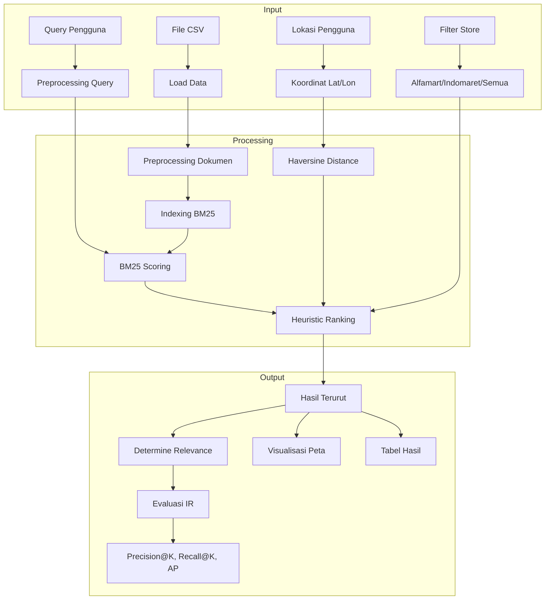
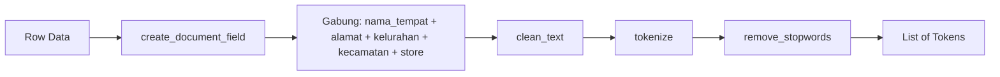
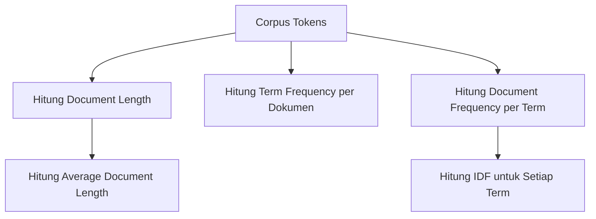
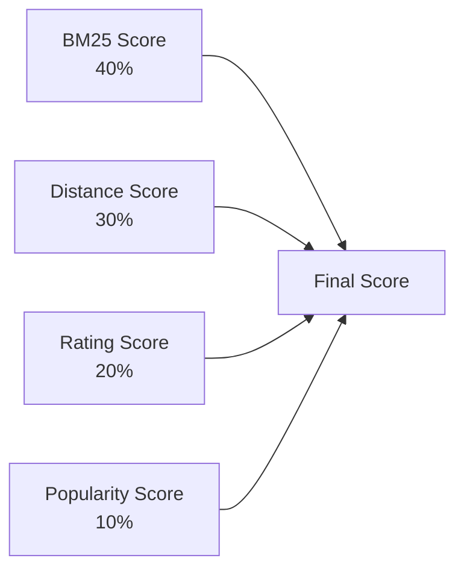
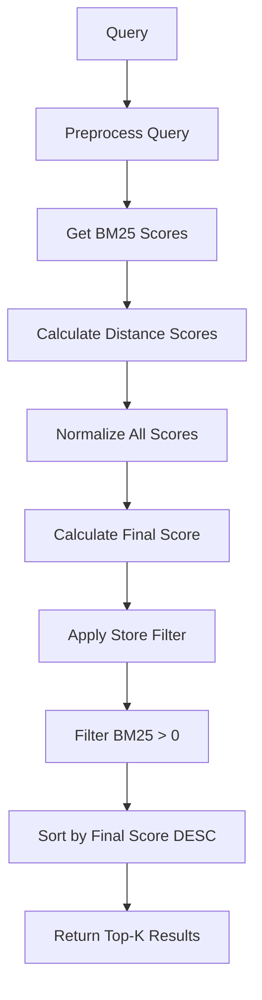
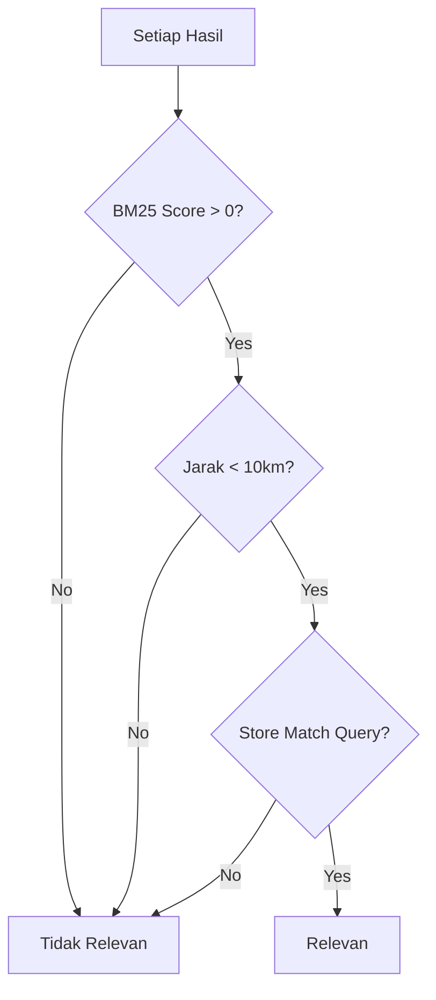
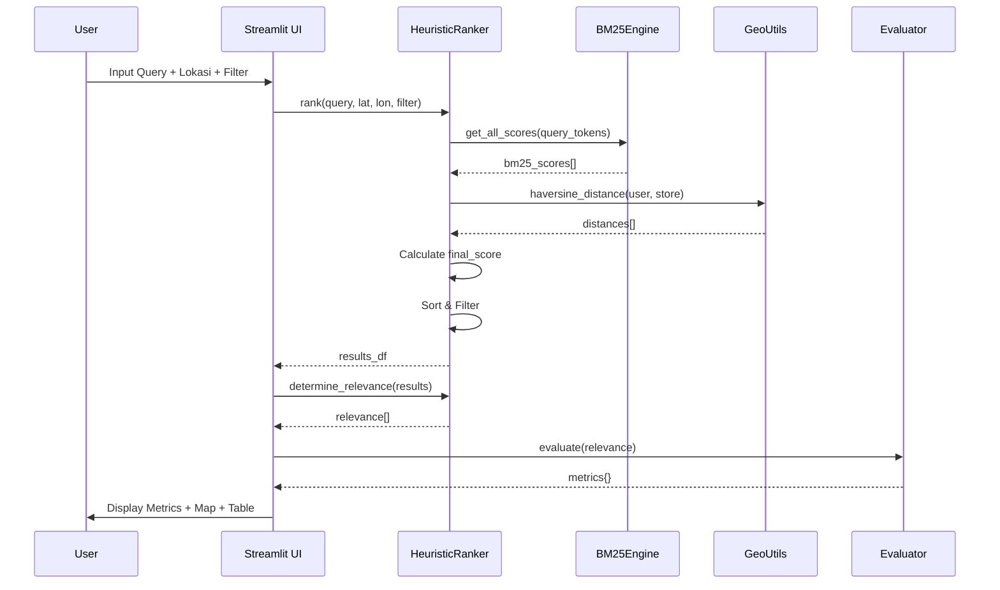

# Penjelasan End-to-End: Sistem Pencarian Lokasi Minimarket

Dokumen ini menjelaskan alur proses **end-to-end** dari sistem pencarian lokasi minimarket, mulai dari pembacaan data hingga menghasilkan rekomendasi dan evaluasi.

---

## 1. Overview Arsitektur Sistem



---

## 2. Tahap 1: Pembacaan Data (Data Loading)

### File: [app.py](../app.py) → `load_data()`

Data dimuat dari file CSV yang berisi informasi lokasi minimarket di Jakarta Selatan:

```python
@st.cache_data
def load_data():
    data_path = os.path.join(os.path.dirname(__file__), DATA_FILE)
    df = pd.read_csv(data_path)
    return df
```

**Struktur Data:**
| Kolom | Deskripsi |
|-------|-----------|
| `nama_tempat` | Nama minimarket |
| `store` | Tipe toko (Alfamart/Indomaret) |
| `rating_tempat` | Rating Google Maps (0-5) |
| `user_ratings_total` | Jumlah ulasan |
| `alamat_tempat` | Alamat lengkap |
| `nama_kelurahan` | Nama kelurahan |
| `nama_kecamatan` | Nama kecamatan |
| `latitude` | Koordinat latitude |
| `longitude` | Koordinat longitude |

---

## 3. Tahap 2: Menerima Input dari Pengguna

### File: [ui/layout.py](../ui/layout.py) → `render_search_input()`

Sistem menerima **4 jenis input** dari pengguna:

1. **Query Pencarian** - Teks bebas untuk mencari lokasi
2. **Filter Store** - Pilihan: Semua, Alfamart, atau Indomaret
3. **Latitude** - Koordinat latitude pengguna (opsional)
4. **Longitude** - Koordinat longitude pengguna (opsional)

```python
query, store_filter, user_lat, user_lon = render_search_input()
```

---

## 4. Tahap 3: Preprocessing Teks

### File: [core/preprocessing.py](../core/preprocessing.py)

Preprocessing dilakukan pada **dua sisi**: dokumen (data minimarket) dan query pengguna.

### 4.1 Preprocessing Dokumen



**Fungsi utama:**

| Fungsi | Deskripsi |
|--------|-----------|
| `create_document_field()` | Menggabungkan field menjadi satu teks |
| `clean_text()` | Lowercase, hapus punctuation, normalisasi spasi |
| `tokenize()` | Memecah teks menjadi token |
| `remove_stopwords()` | Menghapus kata umum (di, yang, dan, ke, dll) |

### 4.2 Preprocessing Query

```python
def preprocess_query(query: str) -> list:
    cleaned = clean_text(query)
    tokens = tokenize(cleaned)
    # Hapus hanya stopwords sangat umum
    very_common = {'yang', 'di', 'dan', 'ke', 'dari', 'ini', 'itu', 'dengan'}
    tokens = [t for t in tokens if t not in very_common and len(t) > 1]
    return tokens
```

> [!NOTE]
> Query preprocessing lebih permisif dibanding dokumen, hanya menghapus stopwords yang sangat umum.

---

## 5. Tahap 4: BM25 Scoring (Text Relevance)

### File: [core/bm25_engine.py](../core/bm25_engine.py)

BM25 (Best Matching 25) adalah algoritma ranking berbasis **TF-IDF** yang digunakan untuk mengukur relevansi teks.

### 5.1 Formula BM25

```
Score(D, Q) = Σ IDF(qi) × (tf(qi, D) × (k1 + 1)) / (tf(qi, D) + k1 × (1 - b + b × |D|/avgdl))
```

**Parameter:**
- `k1 = 1.5` - Mengontrol saturasi term frequency
- `b = 0.75` - Mengontrol normalisasi panjang dokumen

### 5.2 Proses Indexing (Fit)



### 5.3 Proses Scoring

```python
def score(self, query: List[str], doc_idx: int) -> float:
    score = 0.0
    for term in query:
        tf = term_freqs.get(term, 0)
        idf = self.idf[term]
        numerator = tf * (self.k1 + 1)
        denominator = tf + self.k1 * (1 - self.b + self.b * doc_len / self.avgdl)
        score += idf * numerator / denominator
    return score
```

---

## 6. Tahap 5: Kalkulasi Jarak (Haversine Distance)

### File: [core/geo_utils.py](../core/geo_utils.py)

Jika pengguna memberikan lokasi, sistem menghitung jarak geografis menggunakan formula **Haversine**.

### 6.1 Formula Haversine

```
a = sin²(Δlat/2) + cos(lat1) × cos(lat2) × sin²(Δlon/2)
c = 2 × arcsin(√a)
d = R × c
```

Dimana `R = 6371 km` (radius bumi).

### 6.2 Konversi Jarak ke Skor

```python
def calculate_distance_score(distance: float, max_distance: float = 10) -> float:
    if distance >= max_distance:
        return 0.0
    # Linear decay: semakin dekat = skor lebih tinggi
    score = 1.0 - (distance / max_distance)
    return max(0.0, min(1.0, score))
```

---

## 7. Tahap 6: Heuristic Ranking

### File: [core/ranking.py](../core/ranking.py) → `HeuristicRanker`

Sistem menggabungkan **4 faktor** untuk menghasilkan skor final:



### 7.1 Formula Final Score

```python
final_score = (
    0.4 × bm25_score_normalized +
    0.3 × distance_score +
    0.2 × rating_score +
    0.1 × popularity_score
)
```

### 7.2 Normalisasi Skor

| Faktor | Normalisasi |
|--------|-------------|
| BM25 | Min-max normalization ke 0-1 |
| Distance | Linear decay dari max 10km |
| Rating | rating / 5.0 |
| Popularity | user_ratings / max_user_ratings |

### 7.3 Proses Ranking



---

## 8. Tahap 7: Menentukan Relevansi (Ground Truth)

### File: [core/ranking.py](../core/ranking.py) → `determine_relevance()`

Untuk evaluasi, sistem menentukan relevansi menggunakan **rule-based heuristic**:



**Aturan Relevansi:**
1. Harus ada kecocokan teks (BM25 > 0)
2. Jarak < 10km (jika lokasi tersedia)
3. Tipe store sesuai query (jika disebutkan)

---

## 9. Tahap 8: Evaluasi Information Retrieval

### File: [core/evaluation.py](../core/evaluation.py) → `Evaluator`

Sistem menggunakan **3 metrik utama** untuk mengukur kualitas pencarian:

### 9.1 Precision@K

```
Precision@K = |Relevant dalam Top-K| / K
```

**Interpretasi:** "Dari K hasil teratas, berapa persen yang benar-benar relevan?"

### 9.2 Recall@K

```
Recall@K = |Relevant dalam Top-K| / |Total Relevant|
```

**Interpretasi:** "Dari semua lokasi relevan, berapa persen yang berhasil ditemukan?"

### 9.3 Average Precision (AP)

```
AP = (1/|R|) × Σ P(k) × rel(k)
```

**Interpretasi:** "Seberapa baik sistem menempatkan hasil relevan di posisi atas?"

### 9.4 Implementasi

```python
def evaluate(self, relevance: List[bool], k: int = 10) -> Dict[str, float]:
    return {
        'precision_k': self.precision_at_k(relevance, k),
        'recall_k': self.recall_at_k(relevance, k),
        'average_precision': self.average_precision(relevance),
        'k': k
    }
```

---

## 10. Tahap 9: Output dan Visualisasi

### 10.1 Tampilan Metrik Evaluasi

File: [ui/metrics_view.py](../ui/metrics_view.py)

Menampilkan hasil evaluasi dalam bentuk metrik yang mudah dipahami.

### 10.2 Visualisasi Peta Interaktif

File: [ui/map_view.py](../ui/map_view.py)

Menggunakan **Folium** untuk menampilkan peta dengan marker lokasi minimarket.

### 10.3 Tabel Hasil Ranking

File: [ui/result_table.py](../ui/result_table.py)

Menampilkan hasil dalam tabel dengan informasi lengkap dan indikator relevansi.

---

## 11. Diagram Alur End-to-End



---

## 12. Konfigurasi Sistem

### File: [config.py](../config.py)

| Parameter | Nilai | Deskripsi |
|-----------|-------|-----------|
| `BM25_K1` | 1.5 | Saturasi term frequency |
| `BM25_B` | 0.75 | Normalisasi panjang dokumen |
| `MAX_DISTANCE_KM` | 10 | Jarak maksimum relevan |
| `DEFAULT_K` | 10 | Default K untuk evaluasi |
| `WEIGHTS.bm25_score` | 0.4 | Bobot BM25 |
| `WEIGHTS.distance_score` | 0.3 | Bobot jarak |
| `WEIGHTS.rating_score` | 0.2 | Bobot rating |
| `WEIGHTS.popularity_score` | 0.1 | Bobot popularitas |

---

## 13. Kesimpulan

Sistem ini mengimplementasikan **Information Retrieval** lengkap dengan:

1. **Text Processing** - Preprocessing dan tokenisasi teks Bahasa Indonesia
2. **BM25 Ranking** - Algoritma ranking berbasis TF-IDF
3. **Geolocation** - Kalkulasi jarak menggunakan Haversine
4. **Heuristic Ranking** - Kombinasi multi-faktor dengan bobot terukur
5. **Evaluasi IR** - Metrik standar Precision, Recall, dan AP

Sistem dirancang untuk memberikan hasil pencarian yang **relevan**, **terukur**, dan **transparan** dengan menampilkan metrik evaluasi kepada pengguna.
