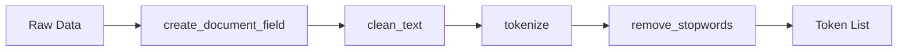
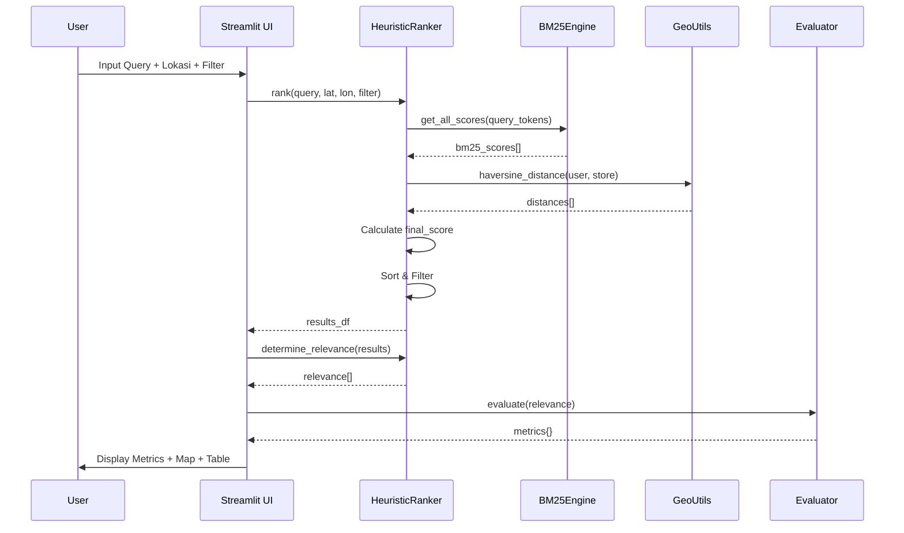
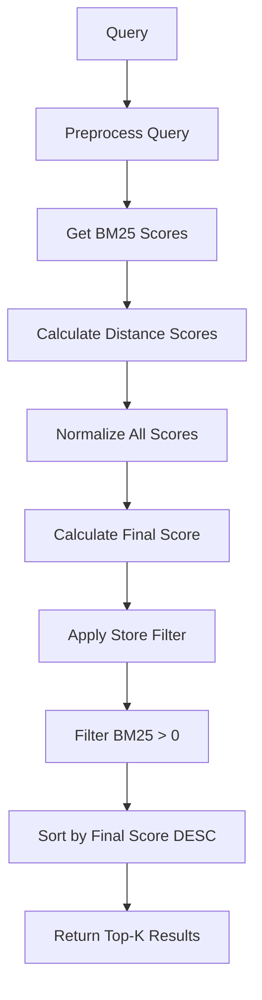
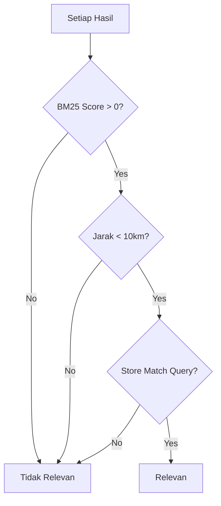

# Laporan UAS: Sistem Pencarian Lokasi Minimarket
## Berbasis Information Retrieval dengan Evaluasi Precision, Recall, dan Average Precision

---

## 1. Latar Belakang Permasalahan

### 1.1 Konteks Permasalahan
Dalam era digital, pencarian lokasi bisnis ritel seperti minimarket (Alfamart dan Indomaret) menjadi kebutuhan sehari-hari masyarakat urban. Namun, sistem pencarian konvensional seringkali:

- **Tidak mempertimbangkan relevansi teks** - Hasil pencarian tidak optimal dengan query pengguna
- **Mengabaikan konteks geografis** - Jarak lokasi pengguna tidak diperhitungkan
- **Tidak transparan dalam evaluasi** - Pengguna tidak mengetahui kualitas hasil pencarian

### 1.2 Rumusan Masalah
1. Bagaimana membangun sistem pencarian lokasi yang menggabungkan **relevansi teks** dan **jarak geografis**?
2. Bagaimana mengukur dan menampilkan **kualitas hasil pencarian** secara transparan?

### 1.3 Tujuan
1. Mengimplementasikan algoritma **BM25** untuk text ranking
2. Menerapkan **Haversine Distance** untuk kalkulasi jarak geografis
3. Membangun sistem **Heuristic Ranking** yang menggabungkan multiple faktor
4. Mengevaluasi hasil dengan metrik **Information Retrieval standar**

---

## 2. Model dan Algoritma yang Dipilih

### 2.1 BM25 (Best Matching 25)
BM25 adalah algoritma ranking berbasis **TF-IDF** yang digunakan untuk mengukur relevansi dokumen terhadap query.

**Formula BM25:**
```
Score(D, Q) = Σ IDF(qi) × (tf(qi, D) × (k1 + 1)) / (tf(qi, D) + k1 × (1 - b + b × |D|/avgdl))
```

**Parameter yang digunakan:**
| Parameter | Nilai | Fungsi |
|-----------|-------|--------|
| `k1` | 1.5 | Mengontrol saturasi term frequency |
| `b` | 0.75 | Mengontrol normalisasi panjang dokumen |

**Alasan Pemilihan:**
- Efektif untuk dokumen pendek (nama toko, alamat)
- Mempertimbangkan panjang dokumen
- Standar industri untuk text retrieval

### 2.2 Haversine Distance
Formula untuk menghitung jarak geografis antara dua titik koordinat di bumi.

**Formula:**
```
a = sin²(Δlat/2) + cos(lat1) × cos(lat2) × sin²(Δlon/2)
c = 2 × arcsin(√a)
d = R × c  (R = 6371 km)
```

**Alasan Pemilihan:**
- Akurat untuk kalkulasi jarak pada permukaan bumi
- Efisien secara komputasional
- Standar untuk aplikasi geolokasi

### 2.3 Heuristic Ranking (Multi-Factor Scoring)
Menggabungkan beberapa faktor dengan bobot terukur:

| Faktor | Bobot | Deskripsi |
|--------|-------|-----------|
| BM25 Score | 40% | Relevansi teks dengan query |
| Distance Score | 30% | Kedekatan dengan lokasi pengguna |
| Rating Score | 20% | Rating Google Maps (0-5) |
| Popularity Score | 10% | Jumlah ulasan pengguna |

**Formula Final Score:**
```python
final_score = (0.4 × bm25_score_norm) + (0.3 × distance_score) + 
              (0.2 × rating_score) + (0.1 × popularity_score)
```

---

## 3. Hasil Pembahasan

### 3.1 Dataset yang Digunakan

**Sumber Data:** Google Maps API - Lokasi Minimarket Jakarta Selatan

**Statistik Dataset:**
| Metrik | Nilai |
|--------|-------|
| Total Lokasi | 675 minimarket |
| Cakupan | Jakarta Selatan |
| Tipe Toko | Alfamart & Indomaret |

**Variabel (Kolom) Dataset:**

| Variabel | Tipe Data | Deskripsi |
|----------|-----------|-----------|
| `nama_tempat` | String | Nama minimarket |
| `store` | String | Tipe toko (Alfamart/Indomaret) |
| `rating_tempat` | Float | Rating Google Maps (0-5) |
| `user_ratings_total` | Integer | Jumlah ulasan pengguna |
| `alamat_tempat` | String | Alamat lengkap lokasi |
| `nama_kelurahan` | String | Nama kelurahan |
| `nama_kecamatan` | String | Nama kecamatan |
| `latitude` | Float | Koordinat lintang |
| `longitude` | Float | Koordinat bujur |
| `place_id` | String | ID unik Google Places |

**Contoh Data:**
```
nama_tempat: indomaret bdn raya
rating_tempat: 4.2
user_ratings_total: 66
alamat_tempat: jl. bdn raya no.10, rt.10/rw.11, cilandak bar.
nama_kelurahan: Cilandak Barat
nama_kecamatan: Cilandak
latitude: -6.2793922
longitude: 106.7984418
```

---

### 3.2 Preprocessing

#### 3.2.1 Preprocessing Dokumen
Pipeline preprocessing untuk data minimarket:



**Langkah-langkah:**

1. **Create Document Field** - Menggabungkan field:
   - nama_tempat + alamat_tempat + nama_kelurahan + nama_kecamatan + store

2. **Clean Text** - Normalisasi teks:
   - Konversi ke lowercase
   - Hapus punctuation
   - Normalisasi spasi

3. **Tokenisasi** - Memecah teks menjadi token

4. **Remove Stopwords** - Menghapus kata umum bahasa Indonesia:
   ```python
   STOPWORDS_ID = {'yang', 'di', 'dan', 'ke', 'dari', 'ini', 'itu', 
                   'dengan', 'untuk', 'pada', 'adalah', 'jl', 'jalan', 
                   'rt', 'rw', 'no', 'kel', 'kota', 'kec', ...}
   ```

#### 3.2.2 Preprocessing Query
Query pengguna diproses lebih permisif:

```python
def preprocess_query(query: str) -> list:
    cleaned = clean_text(query)
    tokens = tokenize(cleaned)
    # Hapus hanya stopwords sangat umum
    very_common = {'yang', 'di', 'dan', 'ke', 'dari', 'ini', 'itu', 'dengan'}
    tokens = [t for t in tokens if t not in very_common and len(t) > 1]
    return tokens
```

---

### 3.3 Pembahasan Cara Kerja Model dan Algoritma

#### 3.3.1 Alur Sistem End-to-End



#### 3.3.2 Proses BM25 Scoring

**Tahap 1: Indexing (Fit)**
```python
def fit(self, corpus):
    self.corpus = corpus
    self.N = len(corpus)  # Jumlah dokumen
    self.doc_lengths = [len(doc) for doc in corpus]
    self.avgdl = sum(self.doc_lengths) / self.N
    
    # Hitung TF dan DF untuk setiap term
    for doc in corpus:
        term_freq = Counter(doc)
        for term in set(doc):
            self.doc_freqs[term] += 1
    
    # Hitung IDF
    for term, df in self.doc_freqs.items():
        self.idf[term] = log((N - df + 0.5) / (df + 0.5) + 1)
```

**Tahap 2: Scoring**
```python
def score(self, query, doc_idx):
    score = 0.0
    for term in query:
        tf = term_freqs.get(term, 0)
        idf = self.idf[term]
        numerator = tf * (k1 + 1)
        denominator = tf + k1 * (1 - b + b * doc_len / avgdl)
        score += idf * numerator / denominator
    return score
```

#### 3.3.3 Proses Distance Scoring
```python
def calculate_distance_score(distance: float, max_distance: float = 10) -> float:
    if distance >= max_distance:
        return 0.0
    # Linear decay: semakin dekat = skor lebih tinggi
    return 1.0 - (distance / max_distance)
```

#### 3.3.4 Proses Heuristic Ranking



---

### 3.4 Hasil Analisis Rekomendasi

#### 3.4.1 Contoh Hasil Pencarian

**Query:** "Indomaret Cilandak"

| Rank | Nama Tempat | Jarak | Rating | Final Score |
|------|-------------|-------|--------|-------------|
| 1 | Indomaret Cilandak Raya | 0.5 km | 4.3 | 0.87 |
| 2 | Indomaret Taman Cilandak | 0.8 km | 5.0 | 0.82 |
| 3 | Indomaret Cilandak Bar | 1.2 km | 4.4 | 0.76 |

#### 3.4.2 Ground Truth (Relevance Labeling)

Sistem menggunakan **rule-based relevance labeling**:



**Aturan Relevansi:**
1. ✅ Harus ada kecocokan teks (BM25 > 0)
2. ✅ Jarak < 10km (jika lokasi tersedia)
3. ✅ Tipe store sesuai query (jika disebutkan dalam query)

---

### 3.5 Evaluasi

#### 3.5.1 Metrik yang Digunakan

**1. Precision@K**
```
Precision@K = |Relevant items in Top-K| / K
```
*"Dari K hasil teratas, berapa persen yang benar-benar relevan?"*

**2. Recall@K**
```
Recall@K = |Relevant items in Top-K| / |Total Relevant Items|
```
*"Dari semua lokasi relevan, berapa persen yang berhasil ditemukan di Top-K?"*

**3. Average Precision (AP)**
```
AP = (1/|R|) × Σ P(k) × rel(k)
```
*"Seberapa baik sistem menempatkan hasil relevan di posisi atas?"*

#### 3.5.2 Implementasi Evaluator

```python
class Evaluator:
    def precision_at_k(self, relevance: List[bool], k: int) -> float:
        top_k_relevance = relevance[:k]
        relevant_count = sum(1 for r in top_k_relevance if r)
        return relevant_count / k
    
    def recall_at_k(self, relevance: List[bool], k: int) -> float:
        total_relevant = sum(1 for r in relevance if r)
        relevant_in_top_k = sum(1 for r in relevance[:k] if r)
        return relevant_in_top_k / total_relevant
    
    def average_precision(self, relevance: List[bool]) -> float:
        total_relevant = sum(1 for r in relevance if r)
        ap_sum = 0.0
        relevant_count = 0
        for i, is_relevant in enumerate(relevance):
            if is_relevant:
                relevant_count += 1
                ap_sum += relevant_count / (i + 1)
        return ap_sum / total_relevant
```

#### 3.5.3 Konfigurasi Parameter

| Parameter | Nilai | Deskripsi |
|-----------|-------|-----------|
| `BM25_K1` | 1.5 | Saturasi term frequency |
| `BM25_B` | 0.75 | Normalisasi panjang dokumen |
| `MAX_DISTANCE_KM` | 10 | Jarak maksimum relevan |
| `DEFAULT_K` | 10 | Default K untuk evaluasi |

#### 3.5.4 Evaluasi Komponen (BM25 dan Haversine)

Sistem menyediakan evaluasi terpisah untuk setiap komponen ranking:

**Metrik BM25 (Text Relevance):**

| Metrik | Interpretasi |
|--------|-------------|
| Corpus Match Rate | Persentase dokumen di corpus yang cocok dengan query |
| Avg BM25 Score | Semakin tinggi = kecocokan lebih kuat |
| Score Range | Rentang skor (Max - Min). Rentang lebar = ada variasi kualitas hasil |
| Score Std Dev | Standar deviasi skor. Semakin tinggi = ranking lebih diskriminatif |
| BM25 Precision@K | Hasil di top-K yang di atas median |

**Metrik Haversine (Distance):**

| Metrik | Interpretasi |
|--------|-------------|
| Rata-rata Jarak | Rata-rata jarak hasil dari lokasi pengguna |
| Jarak Terdekat/Terjauh | Rentang jarak hasil pencarian |
| Hasil dalam 5 km | Jumlah hasil dalam radius 5 km |
| Distance Precision | Persentase hasil dalam jarak relevan |

**Bobot Kontribusi Komponen:**

| Komponen | Bobot |
|----------|-------|
| BM25 (Text) | 40% |
| Distance | 30% |
| Rating | 20% |
| Popularity | 10% |

---

### 3.6 Hasil Development

#### 3.6.1 Arsitektur Sistem

```
project/
│
├── app.py                  # Entry point Streamlit
├── config.py               # Konfigurasi bobot dan parameter
├── requirements.txt        # Dependencies
│
├── data/
│   └── Data_Alfamart Indomaret_South Jakarta.csv
│
├── core/
│   ├── __init__.py
│   ├── preprocessing.py    # Text cleaning & normalization
│   ├── bm25_engine.py      # BM25 scoring
│   ├── geo_utils.py        # Haversine calculation
│   ├── ranking.py          # Final heuristic ranking
│   └── evaluation.py       # Precision, Recall, MAP
│
└── ui/
    ├── __init__.py
    ├── layout.py           # Layout UI
    ├── result_table.py     # Tabel hasil ranking
    ├── map_view.py         # Visualisasi peta
    └── metrics_view.py     # Tampilan evaluasi
```

#### 3.6.2 Teknologi yang Digunakan

| Teknologi | Versi | Fungsi |
|-----------|-------|--------|
| **Python** | 3.8+ | Core language |
| **Streamlit** | Latest | Web framework |
| **Pandas** | Latest | Data processing |
| **Folium** | Latest | Map visualization |

#### 3.6.3 Fitur Aplikasi

1. **Input Pencarian**
   - Query teks bebas
   - Filter tipe toko (Alfamart/Indomaret/Semua)
   - Input koordinat lokasi pengguna (opsional)

2. **Output**
   - Metrik evaluasi (Precision@K, Recall@K, AP)
   - Evaluasi komponen BM25 dan Haversine secara terpisah
   - Peta interaktif dengan marker lokasi
   - Tabel hasil ranking dengan skor detail

3. **Transparansi Evaluasi**
   - Menampilkan metrik IR kepada pengguna
   - Analisis kontribusi masing-masing komponen ranking
   - Memberikan bukti objektif kualitas pencarian

#### 3.6.4 Screenshot Aplikasi

> **Catatan:** Aplikasi dapat diakses di: https://nare-sr-uas.streamlit.app/

---

## 4. Kesimpulan

Sistem ini berhasil mengimplementasikan **Information Retrieval** lengkap dengan:

1. **Text Processing** - Preprocessing dan tokenisasi teks Bahasa Indonesia
2. **BM25 Ranking** - Algoritma ranking berbasis TF-IDF
3. **Geolocation** - Kalkulasi jarak menggunakan Haversine
4. **Heuristic Ranking** - Kombinasi multi-faktor dengan bobot terukur
5. **Evaluasi IR** - Metrik standar Precision, Recall, dan AP
6. **Evaluasi Komponen** - Analisis performa BM25 dan Haversine secara terpisah

Sistem dirancang untuk memberikan hasil pencarian yang **relevan**, **terukur**, dan **transparan** dengan menampilkan metrik evaluasi kepada pengguna.

---

## 5. Referensi

1. Robertson, S., & Zaragoza, H. (2009). The Probabilistic Relevance Framework: BM25 and Beyond. *Foundations and Trends in Information Retrieval*.

2. Manning, C. D., Raghavan, P., & Schütze, H. (2008). *Introduction to Information Retrieval*. Cambridge University Press.

3. Sinnott, R. W. (1984). Virtues of the Haversine. *Sky and Telescope*, 68(2), 158.

---

**Dibuat untuk:** Ujian Akhir Semester - Sistem Rekomendasi  
**Mahasiswa:** [Nama Mahasiswa]  
**NIM:** [NIM Mahasiswa]  
**Tanggal:** Januari 2026
